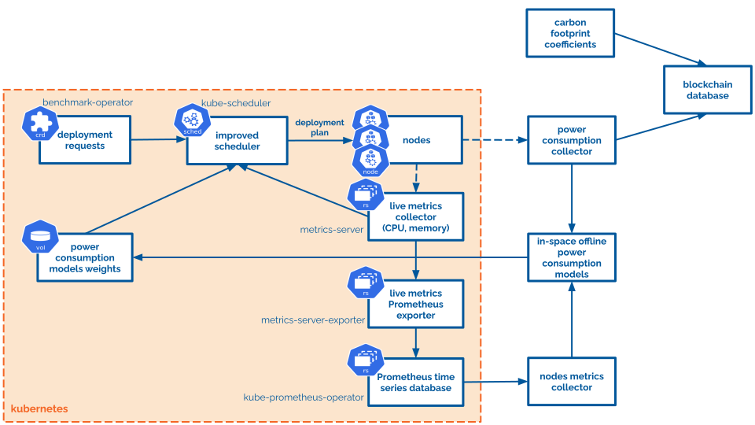

# carbon-scheduling

The repository consists of:
* [`carbon-footprint-data`](./carbon-footprint-data) subdirectory, which contains description of carbon intensity data from electricityMap;
* [`immutable-database`](./immutabe-database/) subdirectory, which contains instructions to deploy blockchain database to separate cluster;
* [`kubernetes-workloads`](./kubernetes-workloads) subdirectory, which contains Ansible playbooks to monitor k8s cluster, run benchmarks and scrape k8s nodes metrics;
* [`power-measurements`](./power-measurements) subdirectory, which contains instructions on measuring servers power consumption using Yokogawa power meter;
* [`power-models`](./power-models) subdirectory, which contains Python source code of power usage models and Ansible playbooks to execute the scripts;
* [`scheduler-plugin`](./scheduler-plugin) subdirectory, which contains Golang source code of custom scheduling plugin and Ansible playbooks to build and deploy the scheduler;

Dependencies between elements contained in each subdirectory are shown on a solution schema below:


## Execution flow
### Prework
1. Setup k8s cluster.
2. Build and push custom scheduler image to GitHub Container Registry.
### Execution
1. Start monitoring k8s cluster and collection of node-level metrics.
2. Run synthetic benchmarks and scrape node CPU and memory usage metrics (+ collect power usage data).
3. Build power consumption models using CPU, memory and power data.
4. Deploy custom scheduler image which generates scheduling decisions using trained decision models.
5. Run workload benchmarks (+ collect power usage data).

## Prework
### Setup local development environment using minikube
**1. Start minikube cluster:**
```console
[root@ansible-controller]# minikube start --nodes 3 --cni calico --extra-config=kubelet.authentication-token-webhook=true --extra-config=kubelet.authorization-mode=Webhook
[root@ansible-controller]# minikube status
[root@ansible-controller]# minikube kubectl
[root@ansible-controller]# minikube addons enable metrics-server

# check if metrics-server works properly
[root@ansible-controller]# kubectl top node

# debugging config
[root@master]# cp /etc/kubernetes/admin.conf ~/.kube/config 
```

\
**2. Install Helm:**
```console
[root@ansible-controller]# curl -fsSL -o get_helm.sh https://raw.githubusercontent.com/helm/helm/main/scripts/get-helm-3
[root@ansible-controller]# chmod 700 get_helm.sh
[root@ansible-controller]# ./get_helm.sh
```

\
**3. Destroy minikube cluster:**
```console
[root@ansible-controller]# minikube delete --all
```

\
**4. Useful commands:**
* Login into minikube control plane node via ssh:
```console
[root@ansible-controller]# ssh -i ~/.minikube/machines/minikube/id_rsa docker@$(minikube ip)
```

### Deploy bare-metal k8s cluster
**1. Clone kubespray repository:**
```console
[root@ansible-controller]# git clone https://github.com/kubernetes-sigs/kubespray
[root@ansible-controller]# cd kubespray
```

\
**2. Create Python venv and install required packages:**
```console
[root@ansible-controller]# python3 -m venv ansible-venv
[root@ansible-controller]# source ansible-venv/bin/activate
[root@ansible-controller]# pip3 install -r requirements.txt
```

\
**3. Prepare Ansible inventory file:**
```console
[root@ansible-controller]# cp -rfp inventory/sample inventory/k8s-cluster
[root@ansible-controller]# declare -a IPS=(10.0.0.115 10.0.0.116)
[root@ansible-controller]# CONFIG_FILE=inventory/k8s-cluster/hosts.yaml python3 contrib/inventory_builder/inventory.py ${IPS[@]}
```

\
**4. Create additional cluster configuration:**
```console
# 1. setup master and worker nodes in inventory/k8s-cluster/hosts.yaml
# 2. use docker as container_manager in inventory/k8s-cluster/group_vars/k8s_cluster/k8s-cluster.yml
# 3. enable helm and metrics-server in inventory/k8s-cluster/group_vars/k8s_cluster/addons.yml
```

\
**5. Setup ssh keys for Ansible:**
```console
[root@ansible-controller:~/]# ssh-keygen -t rsa -b 4096
[root@ansible-controller:~/]# ssh-copy-id -i ~/.ssh/id_rsa.pub root@node1
[root@ansible-controller:~/]# ssh-copy-id -i ~/.ssh/id_rsa.pub root@node2
```

\
**6. Deploy bare-metal cluster:**
```console
[root@ansible-controller]# ansible-playbook -i inventory/k8s-cluster/hosts.yaml  --become --become-user=root cluster.yml
[root@ansible-controller]# kubectl label node node2 node-role.kubernetes.io/worker=
```

\
**7. Prepare kubeconfig on Ansible controller/master node:**
```console
[root@ansible-controller/master:~/]# mkdir ~/.kube
[root@ansible-controller/master:~/]# sudo cp /etc/kubernetes/admin.conf ~/.kube/config
[root@ansible-controller/master:~/]# sudo chmod 644 ~/.kube/config
```

\
**8. Useful commands:**
* Remove bare-metal cluster:
```console
[root@ansible-controller]# ansible-playbook -i inventory/k8s-cluster/hosts.yaml --become --become-user=root reset.yml
```
