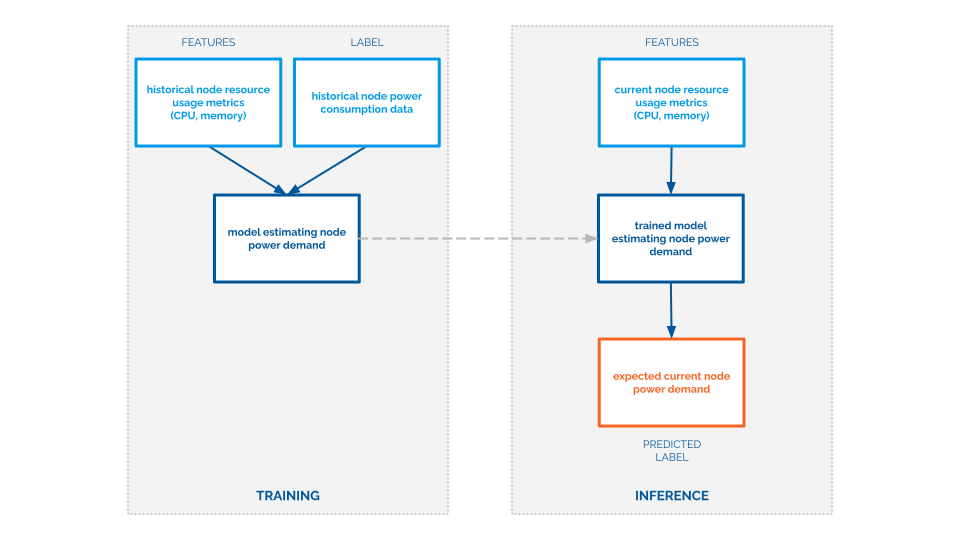

# carbon-aware-scheduling - models predicting server power usage

Input and output data of power models during training and inference phases are shown on a schema below:


## Prework
**1. Prepare Python environment:**
```shell
python3 -m venv ./venv
source ./venv/bin/activate
pip3 install -r requirements.txt
```

How to exit Python environment:
```shell
deactivate
```

## Execution
**1. Run model training:**
```shell
run_id=<benchmark_run_identifier> ansible-playbook ansible-playbook/preprocess-data-and-train-power-model.yaml
```

## Environment variables
### Training parameters
* `create_piecewise_linear_cpu_model`: (default: `False`);
* `epochs`: (default: `300`);
* `only_preprocess_data`: Load data and create plots, do not train model (default: `False`);
* `use_memory_feature`: Train model using memory usage data alongside CPU usage (default: `True`);


